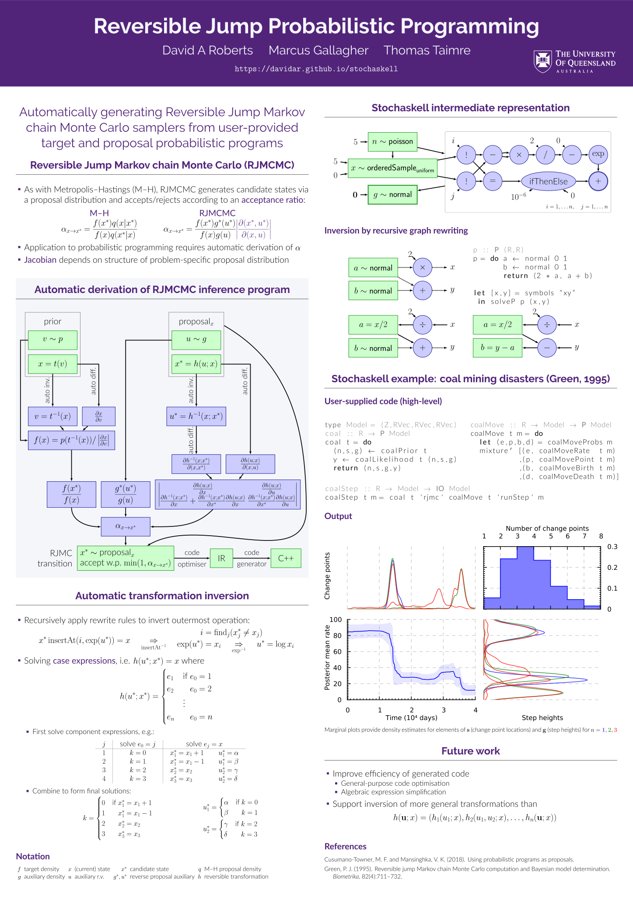
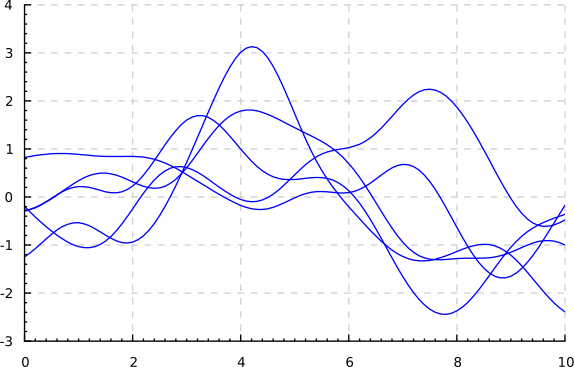
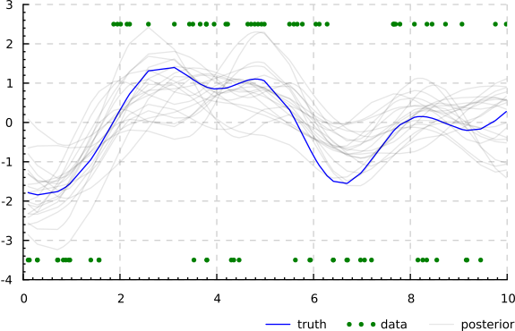
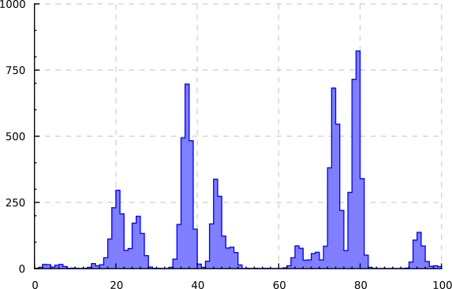
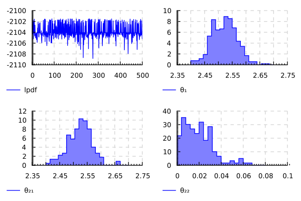
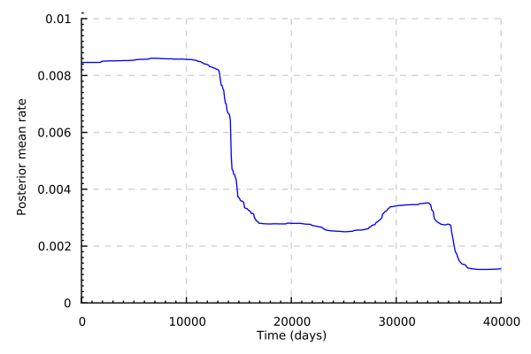
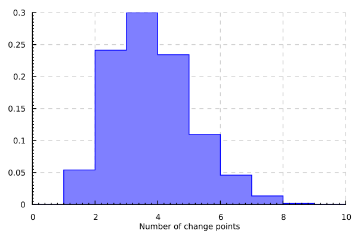
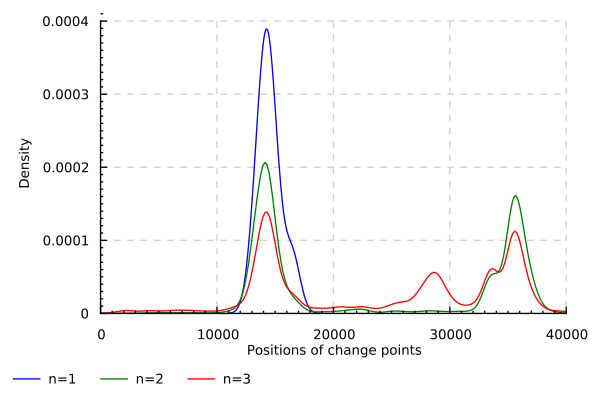
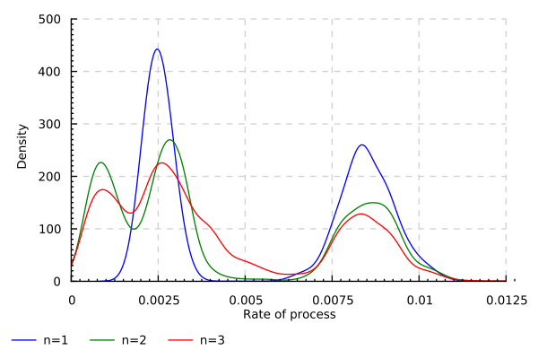

<!-- http://tholman.com/github-corners/ -->
<a href="https://github.com/davidar/stochaskell" class="github-corner" aria-label="View source on GitHub"><svg width="80" height="80" viewBox="0 0 250 250" style="fill:#151513; color:#fff; position: fixed; top: 0; border: 0; right: 0; z-index: 99;" aria-hidden="true"><path d="M0,0 L115,115 L130,115 L142,142 L250,250 L250,0 Z"></path><path d="M128.3,109.0 C113.8,99.7 119.0,89.6 119.0,89.6 C122.0,82.7 120.5,78.6 120.5,78.6 C119.2,72.0 123.4,76.3 123.4,76.3 C127.3,80.9 125.5,87.3 125.5,87.3 C122.9,97.6 130.6,101.9 134.4,103.2" fill="currentColor" style="transform-origin: 130px 106px;" class="octo-arm"></path><path d="M115.0,115.0 C114.9,115.1 118.7,116.5 119.8,115.4 L133.7,101.6 C136.9,99.2 139.9,98.4 142.2,98.6 C133.8,88.0 127.5,74.4 143.8,58.0 C148.5,53.4 154.0,51.2 159.7,51.0 C160.3,49.4 163.2,43.6 171.4,40.1 C171.4,40.1 176.1,42.5 178.8,56.2 C183.1,58.6 187.2,61.8 190.9,65.4 C194.5,69.0 197.7,73.2 200.1,77.6 C213.8,80.2 216.3,84.9 216.3,84.9 C212.7,93.1 206.9,96.0 205.4,96.6 C205.1,102.4 203.0,107.8 198.3,112.5 C181.9,128.9 168.3,122.5 157.7,114.1 C157.9,116.9 156.7,120.9 152.7,124.9 L141.0,136.5 C139.8,137.7 141.6,141.9 141.8,141.8 Z" fill="currentColor" class="octo-body"></path></svg></a><style>.github-corner:hover .octo-arm{animation:octocat-wave 560ms ease-in-out}@keyframes octocat-wave{0%,100%{transform:rotate(0)}20%,60%{transform:rotate(-25deg)}40%,80%{transform:rotate(10deg)}}@media (max-width:500px){.github-corner:hover .octo-arm{animation:none}.github-corner .octo-arm{animation:octocat-wave 560ms ease-in-out}}</style>

<section>

^[{-}
[](poster/poster.pdf)
]

Probabilistic programming systems automate the task of translating specifications of probabilistic models into executable inference procedures.
Here we present *Stochaskell*, an embedded domain-specific language for specifying probabilistic programs
that can be compiled to multiple existing probabilistic programming languages.
Programs are written as Haskell code,
which transparently constructs an intermediate representation that is then passed to specialised code generation modules.
This allows tight integration with existing probabilistic programming systems,
with each system providing inference for different parameters of a model.
These model-specific inference strategies are also written as Haskell code,
providing a powerful means of structuring and composing inference methods.

</section>

## Motivation

At one end of the probabilistic programming spectrum, systems like [Stan](https://mc-stan.org/) produce high-performance inference programs
utilising sampling algorithms such as Hamiltonian Monte Carlo (HMC).
However, a consequence of this is that
Stan does not support sampling discrete model parameters, requiring users to manually marginalise them out of the model prior to implementing it in Stan.[^stanm]
In particular, this precludes the ability to perform inference on models in which the dimensionality of the parameter space is itself a random variable.
At the other end of the spectrum, implementations of Church [@goodman08] emphasise the ability to perform inference with few limitations on the models permitted.

[^stanm]: See [&sect;7 of *Stan User's Guide*](https://mc-stan.org/docs/2_18/stan-users-guide/latent-discrete-chapter.html).

Unfortunately, the model specification language is often tightly coupled with the system for translating the specification into an executable inference program.
This requires users to rewrite their models in a number of different languages
in order to fully take advantage of the variety of available probabilistic programming systems.
Not only is this a burden on the user,
but it also limits the ability to integrate a number of different probabilistic programming systems in the implementation of a single model.
For instance, it may be desirable to infer continuous model parameters with Stan,
whilst delegating the discrete and trans-dimensional parameters of the same model to a more universally applicable method.

Here we present Stochaskell, a probabilistic programming language designed for portability,
allowing models and inference strategies to be written in a single language,
but inference to be performed by a variety of probabilistic programming systems.
This is achieved through runtime code generation,
whereby code is automatically produced to perform inference via an external probabilistic programming system
on subsets of the model specified by the user.
In this way, users can benefit from the diverse probabilistic programming ecosystem
without the cost of manually rewriting models in multiple different languages.

Many probabilistic programming systems
--- particularly those implementing the technique described by @wingate11 ---
rely on code generation by translating probabilistic programs to a *general-purpose* programming language.
Probabilistic C [@paige14] goes further by positioning itself as a code generation *target* language for other probabilistic programming systems.
Hakaru [@narayanan16] performs inference through program transformation,
but both the source and target are expressed in the same probabilistic programming language.
The Fun language [@borgstrom11] is implemented through compilation to Infer.NET programs.
To the best of our knowledge,
Stochaskell is the first probabilistic programming language capable of generating code for multiple probabilistic programming systems,
spanning diverse probabilistic programming paradigms.

## Probabilistic Modelling

In this section,
we will introduce Stochaskell through a number of example probabilistic programs.[^docs]
We begin with a simple program to simulate a homogeneous Poisson process over a fixed interval $[0,t]$, using the standard method [@kroese11, sec. 5.4]:

```hs
poissonProcess :: R -> R -> P (Z,RVec)
poissonProcess rate t = do
  n <- poisson (rate * t)
  s <- orderedSample n (uniform 0 t)
  return (n,s)
```

[^docs]: Also see [A Gentle Introduction to Haskell](https://www.haskell.org/tutorial/) and the [Stochaskell API documentation](./doc/).

The program takes two real numbers as input[^types]
specifying the $\text{rate}>0$ of the process, and the length $t>0$ of the interval, respectively.
The number of points $n$ is simulated according to a Poisson distribution with mean $\text{rate}\times t$,
then the point locations are sampled uniformly from the interval $[0,t]$ and stored in an ordered vector $s$.
The output of the program is the (random) pair of these two values.
We can run the simulation within a Haskell interactive environment, for example:

```hs
> simulate (poissonProcess 1 5)
(2,[1.2151445207978782,2.7518508992238075])
```

[^types]: Each represented by the type `R` in the type signature.
Likewise, `Z` represents integers, `RVec` a vector of reals, and `P (Z,RVec)` a probability distribution over pairs of these.

Of course, the real benefit of probabilistic programming is not just the ability to simulate data, but to infer model parameters given some observed data.
However, we defer further discussion of this to [the following section](#probabilistic-inference), focusing for now on just the programs themselves.

We now consider the following program, which implements a Gaussian process (GP) model [@rasmussen06, sec. 2.2]:

```hs
gp :: (R -> R -> R) -> Z -> RVec -> P RVec
gp kernel n x = do
  let mu = vector [ 0 | i <- 1...n ]
      cov = matrix [ kernel (x!i) (x!j) | i <- 1...n, j <- 1...n ]
  g <- normal mu cov
  return g
```

The definitions of `mu` and `cov` illustrate the usage of Stochaskell's abstract arrays.[^compr]
In contrast to concrete arrays,[^array]
the dimensions of abstract arrays can be specified in terms of random variables.
Array elements can be accessed using the conventional subscript operator,
as witnessed by the expression `(x!i)` providing the value of the `i`th location at which we are evaluating the GP.

[^compr]: Using the *monad comprehensions* language extension.
[^array]: Such as those provided by the standard `Data.Array` module.

It is also worth drawing attention to the fact that the first input to this program is a *function* which takes two real locations and returns the desired covariance of the GP at those locations.[^kernf]
This highlights an advantage of the embedded approach, whereby existing Haskell functions can be freely used within Stochaskell programs.
For instance, in the following code,[^bools]
`kernelSE1` specifies a squared exponential kernel function with unit *signal variance* and *length-scale* hyper-parameters [@rasmussen06, sec. 4.2],
and a small Gaussian observation noise of variance $10^{-6}$.

```hs
kernelSE1 = kernelSE (log 1) (log 1)

kernelSE lsv lls2 a b =
  exp (lsv - (a - b)^2 / (2 * exp lls2))
  + if a == b then 1e-6 else 0
```

[^kernf]: The kernel function should be symmetric and positive semidefinite [@rasmussen06, sec. 4.1].
[^bools]: Here we are utilising the
[`Data.Boolean.Overload` module](https://hackage.haskell.org/package/Boolean)
to ensure the definition is sufficiently polymorphic.

Although it is possible to use the provided `normal` primitive to sample from a multivariate Gaussian distribution,
[^fig-gp]
it is also possible to do so more explicitly by transforming a vector of (univariate) standard normal samples,
which can be useful for fine-tuning inference efficiency.
The following program defines such a transformation with the aid of a Cholesky decomposition [@kroese11, sec. 4.3]:

```hs
normalChol :: Z -> RVec -> RMat -> P RVec
normalChol n mu cov = do
  w <- joint vector [ normal 0 1 | i <- 1...n ]
  return (mu + chol cov #> w)
```

The `joint` keyword indicates that we are sampling a random vector whose elements have the given marginal distributions.
Note that, although the elements of this random vector are (conditionally) independent,
correlations can be induced by applying a deterministic transformation,
as with the matrix-vector multiplication (`#>`) in the above program.

Building upon this, we can write a GP classification model [@rasmussen06, sec. 3.3],
where `bernoulliLogit` represents the logit-parametrised $\mathrm{Bernoulli}(\mathrm{logit}^{-1}(\cdot))$ distribution:

```hs
gpClassifier :: (R -> R -> R) -> Z -> RVec -> P (RVec,BVec)
gpClassifier kernel n x = do
  g <- gpChol kernel n x
  phi <- joint vector [ bernoulliLogit (g!i) | i <- 1...n ]
  return (g,phi)
```

In this example, `gpChol` is itself a probabilistic program,
defined much like the `gp` program earlier, but utilising the `normalChol` program instead of the `normal` primitive.
This demonstrates how sub-programs can be easily composed in Stochaskell, another benefit we obtain for free from embedding.

[^fig-gp]: {-}

Plot of five independent simulations of `gp kernelSE1`.
[![Binder]](https://mybinder.org/v2/gh/davidar/stochaskell/master?filepath=gp.ipynb)

Now for a somewhat different example,
this program implements the stick-breaking process of @sethuraman94 with concentration parameter $\alpha>0$:

```hs
stickBreak :: R -> P RVec
stickBreak alpha = do
  sticks <- joint vector [ beta 1 alpha | i <- 1...infinity ] :: P RVec
  let sticks' = vector [ 1 - (sticks!i) | i <- 1...infinity ]
      rems = scanl (*) 1 sticks'
      probs = vector [ (sticks!i) * (rems!i) | i <- 1...infinity ]
  return probs
```

Here we are utilising the higher-order function *scan*.
Much like the closely-related *fold* operation
(sometimes called *reduce* or *accumulate*),
scan allows us to recursively combine elements of an array.
In this example, `rems` is a vector containing the cumulative product of `sticks'`.
Although fold and scan provide only a restricted form of recursion,
they are powerful enough to be able to implement practically useful models such as Dirichlet processes (DP), as demonstrated in the following program.
Stochaskell supports using higher-order functions like these, rather than allowing unlimited recursion,
in order to provide a balance between expressiveness and portability,
in consideration of the fact that some probabilistic programming systems may support only limited forms of recursion, if at all.

```hs
dirichletProcess :: R -> P R -> P (P R)
dirichletProcess alpha base = do
  probs <- stickBreak alpha
  atoms <- joint vector [ base | i <- 1...infinity ]
  let randomDistribution = do
        stick <- pmf probs
        return (atoms!stick)
  return randomDistribution
```

Note that we can see from the type signature that this program encodes a *distribution over distributions*.
These random distributions can be used like any other sub-program, as shown in this implementation of a DP mixture model [@neal00]:

```hs
dpmm :: Z -> P RVec
dpmm n = do
  let base = uniform 0 100
  paramDist <- dirichletProcess 5 base
  params <- joint vector [ paramDist | j <- 1...n ]
  values <- joint vector [ normal (params!j) 1 | j <- 1...n ]
  return values
```

### Intermediate Representation

See @roberts19 [sec. 3.1].

## Probabilistic Inference

Statistical inference, within a Bayesian paradigm,
involves the consideration of the posterior distribution of model parameters conditioned on observed data.
For clarity, we will focus on the common case of performing inference by drawing approximate samples from the posterior via Markov chain Monte Carlo (MCMC) methods.
However, note that Stochaskell does not restrict itself to this case,
and integration with a wide range of different inference methods is possible.
Posterior distributions can be expressed in Stochaskell with a familiar notation,[^guard]
for instance given a probabilistic program `prior` and some `observed` data:

```hs
posterior = [ z | (z,y) <- prior, y == observed ]
```

[^guard]: Thanks to monad comprehensions, and a generalised `guard` function.

Stochaskell supports programmable inference, as introduced by @mansinghka14,
with inference strategies expressed in the same language as the model, i.e. Haskell.
This allows us to seamlessly combine different inference methods,
be they provided by native Haskell code or external probabilistic programming systems.
In the latter case, runtime code generation allows us to offload inference of different parts of a model without any manual code duplication.

### Stan Integration

Stochaskell integrates with Stan, to provide high-performance inference for (conditionally) fixed-dimensional, continuous model parameters.
This is achieved by automatically translating Stochaskell programs into Stan code,
compiling the resulting code with [CmdStan](https://mc-stan.org/users/interfaces/cmdstan),
then executing the compiled model and parsing the results so that they can be further processed within Haskell.
This allows the user to offload inference to Stan with a single line of code,
receiving a list of posterior samples in return:
[^fig-stan]

```hs
samples <- hmcStan posterior
```

The IR outlined in [the previous section](#intermediate-representation)
can be translated to Stan code in a fairly straightforward manner.
Each Apply node is translated to variable definition with an automatically generated identifier.
Array definitions correspond to a for-loop, or a set of nested for-loops,
which iterate over each possible index value and store the appropriate element value into an array.
A Fold node produces code that first assigns the default value to a variable,
then iteratively updates it by looping over the elements of the vector.

Similar backends are also provided for integration with [PyMC3](https://docs.pymc.io/) and [Edward](http://edwardlib.org/).

[^fig-stan]: {-}

Plot of posterior samples from the Gaussian process classification model program
from [the previous section](#probabilistic-modelling),
sampled via the Stan backend.
[![Binder]](https://mybinder.org/v2/gh/davidar/stochaskell/master?filepath=gp.ipynb)

### Church Integration

To demonstrate the portability of Stochaskell across a variety of probabilistic programming paradigms,
we also provide integration with Church.
The implementation and usage of this is quite similar to the Stan backend,
allowing inference to be easily offloaded:
[^fig-dp]

```hs
samples <- mhChurch posterior
```

The main conceptual difference from the Stan code generation is that for Church, arrays are represented by *memoised functions*.
In particular, random arrays --- constructed with the `joint` keyword in Stochaskell --- utilise Church's support for *stochastic memoisation* [@goodman08, sec. 2.1].

The figure on the right illustrates a simulation of the DP mixture model program presented in [the previous section](#probabilistic-modelling), sampled via the Church backend.

[^fig-dp]: {-}

Histogram of $n=10^4$ samples from the Dirichlet process mixture model program
from [the previous section](#probabilistic-modelling),
via the [WebChurch](https://github.com/probmods/webchurch) implementation of Church.
[![Binder]](https://mybinder.org/v2/gh/davidar/stochaskell/master?filepath=dp.ipynb)

### Metropolis--Hastings

Stochaskell provides a native Haskell library for both simulating probabilistic programs,
as well as computing the probability density function of the distribution they represent where possible.
A notable feature of the latter is that we provide limited support for computing the density of transformed random variables.
Suppose we have $Z=h(X)$, where $X$ and $Z$ are real random vectors of common dimension.
In the case that the transformation $h$ is invertible,
the density of $Z$ can be computed from that of $X$ by applying the formula

$$p_Z(z)=\frac{p_X(h^{-1}(z))}{|J_h(h^{-1}(z))|}$$

where the denominator is the absolute value of the determinant of the Jacobian matrix of the transformation $h$ [@kroese11, sec. A.6].
The Jacobian matrix is computed using automatic differentiation, and the inverse transform $h^{-1}(z)$ is calculated by the following procedure.
Given an expression graph representing $h(x)$,
we associate the root node with the value of $z$,
then walk the graph associating values with nodes whenever they can be fully determined by the values of neighbouring nodes.
When this process succeeds, the nodes representing $x$ will be associated with the value of $h^{-1}(z)$.

This density computation library allows us to provide a simple implementation of the Metropolis--Hastings (M--H) inference algorithm,
with support for *user-defined* proposal distributions:[^density]

```hs
mh target proposal x = do
  y <- simulate (proposal x)
  let f = density target
      q z = density' (proposal z)
      a = fromLogFloat $
        (f y * q y x) / (f x * q x y)
  accept <- bernoulli (if a > 1 then 1 else a)
  return (if accept then y else x)
```

[^density]: Here `density` includes the Jacobian adjustment, whereas `density'` does not.
The latter allows us to use proposals which make few random choices relative to the size of the state,
under the assumption that they do not involve non-trivial transformations.

    *Note: these functions have been deprecated in favour of the more efficient `lpdf` and `lpdfAux` functions.*

Proposals are specified by probabilistic programs written in Stochaskell, alongside the model.
For instance, given the following random walk proposal:

```hs
proposal :: R -> P R
proposal x = do
  z <- normal 0 1
  return (x + z)
```

we can sample from the distribution represented by some `program` via M--H as follows:

```hs
x <- chain n (program `mh` proposal) x0
```

where `n` is the number of iterations and `x0` is some initial state.

### Reversible Jump Markov Chain Monte Carlo

See @roberts19.

***

<figure>
^[{-}
Replication of @green09 [fig. 1] with a Reversible Jump sampler automatically derived by Stochaskell using the method described in @roberts19.
[![Binder]](https://mybinder.org/v2/gh/davidar/stochaskell/master?filepath=rj.ipynb)
]
{width=100%}
</figure>

<figure>
^[{-}
Replication of @green95 [figs. 1--4], as above.
[![Binder]](https://mybinder.org/v2/gh/davidar/stochaskell/master?filepath=rj-coal.ipynb)
]
<table style="border-width:1px; border-color:#ccc"><tr>
<td></td>
<td></td>
</tr><tr>
<td></td>
<td></td>
</tr></table>
</figure>

## Usage

To quickly get started using Stochaskell, it can be [launched via Binder](https://mybinder.org/v2/gh/davidar/stochaskell/master).
It can also be launched on a local machine by [installing Docker](https://docs.docker.com/install/) and running the following commands:

^[{-}
[](https://microbadger.com/images/davidar/stochaskell)
[](https://circleci.com/gh/davidar/stochaskell/tree/master)
]

<pre><code>docker pull <a href="https://hub.docker.com/r/davidar/stochaskell">davidar/stochaskell</a>
docker run -it -p8888:8888 davidar/stochaskell
</code></pre>

To build from source, rather than using a pre-built image, run the following commands:

<pre><code>git clone --recursive <a href="https://github.com/davidar/stochaskell.git">https://github.com/davidar/stochaskell.git</a>
docker build -t stochaskell:latest stochaskell/
docker run -it -p8888:8888 stochaskell:latest
</code></pre>

## References {-}

<div id="refs" class="references fullwidth"></div>

[Binder]: https://mybinder.org/badge_logo.svg
